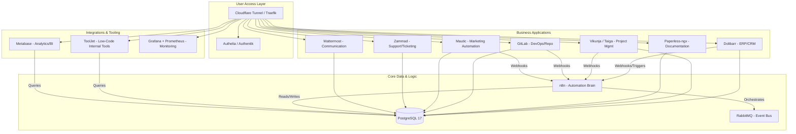

This is a comprehensive architecture design request. Below is a **complete open-source, self-hosted software stack** designed to run a 1–2 person company and scale cleanly to 50 people, with an emphasis on automation and integration.

---

### 0. Guiding Philosophy: The "Composable ERP" Approach
Instead of installing one monolithic ERP (like Odoo or ERPNext) that does everything, we will build a **composable stack**. We use best-of-breed open-source tools connected via an automation layer. This prevents lock-in and allows you to swap out components as you scale.

- **The Brain:** n8n (Automation/Orchestration)
- **The Record System:** PostgreSQL (Source of Truth)
- **The Glue:** Webhooks / APIs

---

### 1. Suggested Overall Architecture

The stack is designed around a **centralized PostgreSQL database** and an **automation hub**.

**Key Interactions:**
- **Identity Provider (Authelia/Keycloak):** Central SSO. One login for all tools.
- **Automation Hub (n8n):** Listens for webhooks from CRM, Project Mgmt, etc. Updates records, sends notifications, and creates invoices.
- **Shared Database (PostgreSQL):** Most tools write here. n8n and Metabase read from here to create reports and automate cross-tool workflows without API calls.
- **Event Bus (RabbitMQ):** For high-reliability decoupled events (optional until team >10).

---

### 2. Domain-by-Domain Tool Selection

| Domain | Option A (Lightweight / Modern) | Option B (Feature-Complete / Traditional) | Option C (All-in-One) | Why it fits 1→50 |
| :--- | :--- | :--- | :--- | :--- |
| **1. Automation / Orchestration** | **n8n** (Fair-code, self-host) | **Node-RED** (Apache 2.0) | **StackStorm** (Apache 2.0) | **n8n** has the best GUI for business users; scales via queueing.  |
| **2. CRM** | **Dolibarr** (GPL) | **SuiteCRM** (GPL) | **Odoo Community** (LGPL) | **Dolibarr** is lightweight, runs on low specs, and handles 80% of use cases.  |
| **3. ERP / Accounting** | **Dolibarr** (GPL) | **Odoo** (Community) | **iDempiere** (GPL) | Dolibarr handles invoicing, products, and stock perfectly for sub-50 staff.  |
| **4. Project / Task Mgmt** | **Vikunja** (AGPL) | **Taiga** (AGPL) | **OpenProject** (GPL) | **Vikunja** is simple and fast; integrates via API. |
| **5. Documentation / KB** | **Paperless-ngx** (GPL) | **BookStack** (MIT) | **Wiki.js** (AGPL) | **Paperless** for internal docs/scanning; **BookStack** for public-facing KB. |
| **6. File Storage / Collab** | **Seafile** (GPL) | **Nextcloud** (AGPL) | **Sync-in** (AGPL)  | **Seafile** is faster and lighter than Nextcloud for teams <50. **Sync-in** is a newer option.  |
| **7. Internal Comms (Chat)** | **Mattermost** (MIT) | **Rocket.Chat** (MIT) | **Matrix/Synapse** (Apache) | **Mattermost** feels like Slack; easy for non-technical staff. |
| **7. Internal Comms (Video)** | **Jitsi Meet** (Apache) | **LiveKit** (Apache) | **OpenVidu** (AGPL) | Jitsi is simple to deploy alongside the main stack. |
| **8. Email / Marketing Auto** | **Mautic** (GPL) | **Listmonk** (AGPL) | **Sendy** (PHP license) | **Mautic** is the standard, but heavy. **Listmonk** is lighter for newsletters. |
| **9. Sales Pipeline** | **Dolibarr** (GPL) | **Odoo CRM** (LGPL) | **Twenty** (AGPL) | Covered by the CRM (Dolibarr). Twenty is a modern alternative but newer. |
| **10. Support / Ticketing** | **Zammad** (AGPL) | **FreeScout** (AGPL) | **UVDesk** (BSD) | **Zammad** has the best UX and strong automation triggers. |
| **11. Data Storage / DB** | **PostgreSQL** (PostgreSQL) | **MariaDB** (GPL) | **ClickHouse** (Apache) | PostgreSQL is the relational backbone for 90% of tools.  |
| **12. API Layer / Integration** | **n8n** (Fair-code) | **Apache Camel** (Apache) | **Kong** (Apache) | n8n acts as the API glue. Kong if you need a gateway for public APIs. |
| **13. Low-Code / Internal Tools** | **ToolJet** (AGPL) | **Budibase** (GPL) | **Appsmith** (AGPL) | **ToolJet** connects to your PostgreSQL and lets non-devs build dashboards.  |
| **14. Monitoring / Observability** | **Prometheus + Grafana** (Apache) | **Netdata** (GPL) | **Uptime Kuma** (MIT) | **Prometheus/Grafana** is the industry standard.  |
| **15. Authentication / IdM** | **Authelia** (Apache) | **Keycloak** (Apache) | **UNITY** (BSD)  | **Authelia** is lightweight for 1-50; **Keycloak** if you need complex SSO/SAML.  |
| **16. Website / CMS** | **Hugo** (MIT) | **WordPress** (GPL) | **Directus** (GPL) | Static site (Hugo) for speed/security. Directus if you need a dynamic headless CMS. |
| **17. Analytics / Dashboards** | **Metabase** (AGPL) | **Redash** (BSD) | **Apache Superset** (Apache) | **Metabase** is the easiest for non-technical staff to query data.  |
| **18. AI Assistants / Agents** | **OpenAkita** (AGPL?)  | **n8n AI nodes** | LangChain (self-host) | **OpenAkita** seems promising for task automation, but is very new.  Use n8n for simple AI calls. |
| **19. Backup / Disaster Recovery** | **BorgBackup + Vorta** (BSD) | **Restic** (BSD) | **Barman** (GPL) | **Borg** for files; **Barman** for PostgreSQL; automated scripts to S3-compatible storage. |
| **20. DevOps / CI/CD** | **Woodpecker CI** (Apache) | **GitLab CE** (MIT) | **Drone** (Apache) | **GitLab CE** provides repo + CI + registry in one package.  |

---

### 3. Automation Strategy

We use n8n as the central nervous system.

**Example 1: Lead Capture → Project Creation**
1.  **Trigger:** A form on the website (WordPress/Hugo + Netlify Forms) sends a webhook to **n8n**.
2.  **n8n Action:**
    - Creates a new `Lead` in **Dolibarr** (CRM) via REST API.
    - If Lead score > 80%, creates a `Project` in **Vikunja** and assigns it to the sales person.
    - Sends a notification to the sales channel in **Mattermost**.
    - Adds the lead's email to a "Cold Outreach" segment in **Mautic**.

**Example 2: Support Ticket → Invoice**
1.  **Trigger:** Ticket closed in **Zammad** with tag `billable`.
2.  **n8n Action:**
    - Fetches time tracking data from the ticket.
    - Calls **Dolibarr** API to generate a draft invoice.
    - Emails the invoice to the customer and notifies the finance channel in **Mattermost**.

---

### 4. Deployment Strategy

- **Phase 1 (1–10 people): Single VPS + Docker Compose**
    - **Hardware:** 8 vCPU, 16GB RAM, 320GB SSD (Hetzner CX41 or similar).
    - **Method:** Docker Compose with Traefik as reverse proxy. Use named volumes for data.
    - **Backup:** Daily `pg_dump` and volume snapshots to Backblaze B2.
    - **Network:** Cloudflare Tunnel for zero open ports (or Wireguard VPN for admin access).

- **Phase 2 (10–50 people): Small Cluster (K3s)**
    - **Hardware:** 3 nodes (2 app nodes, 1 DB node) or use a larger VPS with K3s.
    - **Storage:** Use Longhorn for distributed block storage.
    - **Database:** Move PostgreSQL to a dedicated VM or use a managed service (like Aiven) to reduce ops load.
    - **Queue:** Add RabbitMQ to the stack to handle async jobs from n8n and the main apps.

---

### 5. Cost Analysis (Self-Hosted, Monthly)

| Item | Cost (Approx) | Notes |
| :--- | :--- | :--- |
| **VPS Hosting** | $25 - $60 | Hetzner / Contabo / Linode. 8GB RAM to start. |
| **Object Storage (Backups)** | $5 - $20 | Backblaze B2 or Wasabi. 500GB - 1TB storage. |
| **Domain & Email** | $10 - $15 | Cloudflare domain + MXRoute or PurelyMail for email hosting. |
| **SMTP Service** | $5 - $10 | SendGrid or Amazon SES (or self-host if you dare). |
| **SSL (Let's Encrypt)** | $0 | Included in Traefik. |
| **Paid Tools (Optional)** | $0 - $50 | Potential for a small license for a better theme or plugin. |
| **Total (Estimate)** | **$45 - $155** | |

*Comparison:* A SaaS stack (Salesforce, Jira, Slack, Office365) would cost **$100+ per user/month**, equating to **$5,000/month for 50 users**. This stack costs less than **$200/month total** + your sysadmin time.

---

### 6. Scaling Considerations

- **At 1–2 People:** Everything can run on a single $10/mo VPS (Docker Compose). Focus on simplicity.
- **At 10 People:**
    - **Database:** Likely the first bottleneck. Tune PostgreSQL, increase RAM.
    - **Storage:** Nextcloud/Seafile will start filling up. Move files to a separate volume or S3.
    - **Monitoring:** Uptime Kuma is no longer enough; deploy Prometheus/Grafana stack.
- **At 50 People:**
    - **Identity:** Authelia might struggle; upgrade to Keycloak with LDAP.
    - **Automation:** n8n might need dedicated workers and a message queue.
    - **Backup:** Implement Point-in-Time Recovery for PostgreSQL.
    - **Email:** Mautic might need dedicated sending infrastructure (e.g., Inbucket for testing, SES for production).

---

### 7. Minimal Stack (The "Micro-Company" Stack)

If you are a solo founder or 2-person team and want the absolute minimum to run a business:

1.  **Dolibarr** (Covers: CRM, ERP, Invoicing, Sales Pipeline) 
2.  **Vikunja** (Project Management)
3.  **Paperless-ngx** (Documentation)
4.  **Mattermost** (Communication)
5.  **n8n** (Automation - glue between the above) 
6.  **PostgreSQL** (Single DB for all) 
7.  **Traefik + Authelia** (Auth and Proxy)

*This covers 80% of business functions on one server.*

---

### 8. Advanced Stack (The "Scale-Ready" Stack)

For a 50-person company with high automation needs:

1.  **Automation:** n8n + RabbitMQ + Redis 
2.  **ERP/CRM:** Dolibarr (customized) 
3.  **Project:** Taiga (for Agile/Dev teams)
4.  **Docs:** BookStack (Internal Wiki) + Paperless-ngx (Archive)
5.  **Files:** Seafile
6.  **Comms:** Mattermost + Jitsi
7.  **Marketing:** Mautic
8.  **Support:** Zammad
9.  **Database:** PostgreSQL + Barman for backups
10. **Low-Code:** ToolJet 
11. **Monitoring:** Prometheus + Grafana + Loki
12. **Identity:** Keycloak 
13. **Website:** Directus (Headless CMS) + Nuxt.js frontend
14. **Analytics:** Metabase 
15. **CI/CD:** GitLab CE 
16. **Infra:** K3s + Longhorn + Traefik

---

### 9. Tools to Avoid (Why)

- **Apache Airflow:** Overkill for business workflows. Designed for data engineering. High ops cost. 
- **Odoo (defaulting to All-in-One):** While powerful, customizing it often requires Python expertise. The community version is limited, and the temptation to use paid apps is high.
- **OwnCloud:** Nextcloud is superior, and Seafile is faster. OwnCloud has lost the "self-hosted file sync" war.
- **Jenkins:** Too heavy for CI/CD unless you have a dedicated build team. GitLab CI is better integrated. 
- **Custom-coded integrations:** Avoid custom scripts for glue. Use n8n or Node-RED so non-devs can see the logic.

### 10. Final Recommendation

Start with the **Minimal Stack** (Dolibarr + Vikunja + n8n + Paperless + Mattermost) on a single Docker host. As you hit 10 people, implement **ToolJet** for internal dashboards and **GitLab** for development. By 50 people, you will know exactly which component is the bottleneck and can scale that specific tool independently, thanks to the composable architecture.