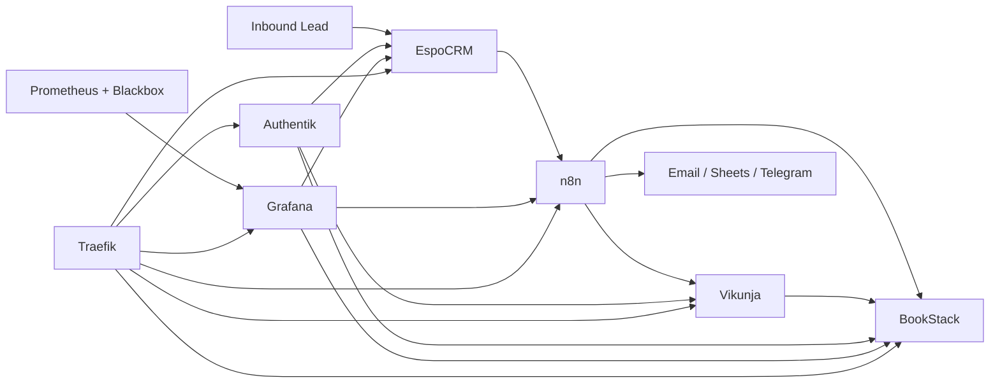

# Tool Relationship Map

## Purpose of each tool

| Tool | Main value | System of record for | Who lives in it |
|---|---|---|---|
| Authentik | one identity backbone | people, groups, app access | everyone |
| n8n | automation engine | workflow logic and integrations | founder, delivery lead |
| EspoCRM | commercial memory | leads, companies, deals, client contacts | founder, client success |
| Vikunja | execution tracking | implementation tasks and delivery status | delivery lead, client success |
| BookStack | operational memory | SOPs, client docs, handover notes | whole team |
| Grafana | trust and visibility | service health dashboards and future funnel metrics | whole team |
| Traefik | secure edge | routing and TLS | infrastructure |
| Postgres / MariaDB | application state | app databases | infrastructure |

## How the tools relate

## Practical flow

### Sales to delivery
- EspoCRM holds the deal.
- n8n reacts to stage changes or manual commands.
- Vikunja gets the implementation checklist.
- BookStack gets the project handbook and implementation notes.

### Delivery to support
- Alex updates technical steps in BookStack.
- Marta tracks follow-ups in Vikunja.
- Joan Marc reviews client status in EspoCRM.
- Grafana tells the team whether public components are healthy and leaves room for funnel reporting later.

### Reporting and handover
- n8n turns operational events into emails, sheets, or Telegram messages.
- BookStack becomes the permanent handover surface.
- EspoCRM remains the commercial/client context.

## Recommended ownership boundaries

- Do not use n8n as the only place where client context lives.
- Do not use Vikunja as the source of truth for commercial state.
- Do not use BookStack as the place to track live task status.
- Do use n8n to move information between those systems.

Unknown / Not verified yet:
- the exact integration path from EspoCRM to n8n in this stack is not wired yet; the current repo demonstrates the pattern, not a full live CRM trigger
